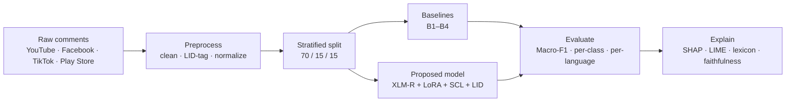
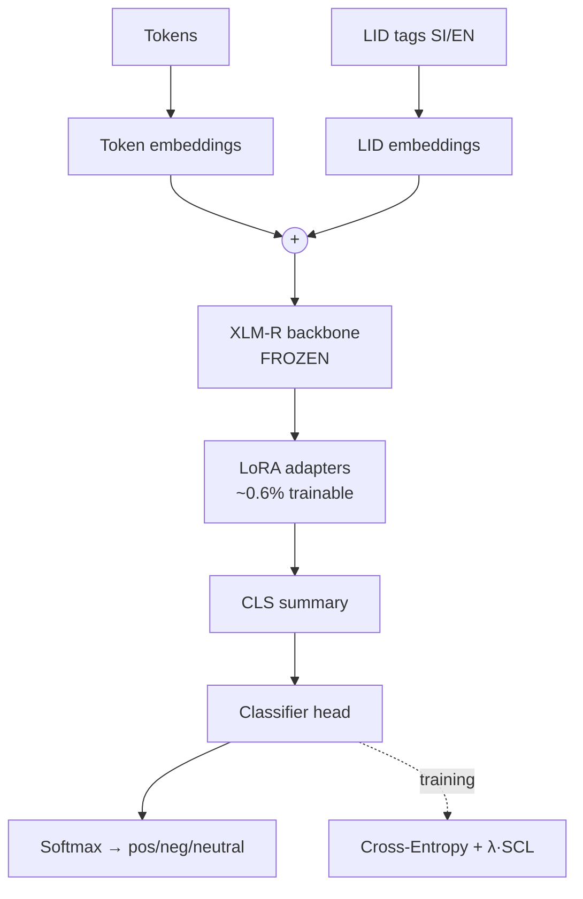

# Sinhala–English Code-Mixed Sentiment Analysis


> Efficient, **explainable** sentiment analysis for **Sinhala–English code-mixed (“Singlish”)** social-media text, using **parameter-efficient fine-tuning** so it runs on a free GPU.

This is an undergraduate research project. The system classifies a comment as **positive / negative / neutral**, and then **explains** which words drove that decision — with a focus on how Sinhala intensifiers and negations shift sentiment in mixed-language text.

---

## Table of Contents
1. [Motivation](#motivation)
2. [Research Question & Novelty](#research-question--novelty)
3. [Methodology (explained)](#methodology-explained)
4. [Literature Review](#literature-review)
5. [Dataset](#dataset)
6. [Project Structure](#project-structure)
7. [Installation](#installation)
8. [Usage](#usage)
9. [Results](#results)
10. [Roadmap](#roadmap)
11. [References](#references)

---

## Motivation

Sri Lankans rarely write in “pure” Sinhala or “pure” English online. They mix them — often writing Sinhala words in English letters (*romanized Singlish*, e.g. `mama enna`), sometimes mixing scripts (`මම enna`). Most sentiment tools fail on this messy, code-mixed text, and the few that work are **black boxes** — they give a label but no reason. This project tackles both problems: a model that handles code-mixed Singlish **cheaply**, and an explanation layer that shows **why** it predicted what it did.

---

## Research Question & Novelty

**Question:** Can a *parameter-efficient* adaptation of a multilingual transformer match expensive full fine-tuning on Sinhala–English code-mixed sentiment — while remaining explainable?

**Contributions (to the best of our knowledge, the first for Sinhala–English):**

| # | Contribution | Why it matters |
|---|---|---|
| 1 | **LoRA** parameter-efficient fine-tuning for Singlish | Trains ~0.6% of parameters → runs on a free Colab GPU, resists overfitting on small data |
| 2 | **Supervised Contrastive Learning (SCL)** for Singlish | Pulls same-sentiment sentences together regardless of language → robustness to code-mixing |
| 3 | **Language-ID (LID) embeddings** | Tells the model whether each token is Sinhala or English → fixes its weak spot on romanized Sinhala |
| 4 | **Systematic SHAP/LIME lexical analysis** + open cross-domain dataset | Produces *linguistic* insight (how `harima`, `ne`, `epa` shift sentiment), not just a classifier |

---

## Methodology (explained)

### The pipeline



### What each stage does

**1. Data collection.** Public comments are gathered across platforms and domains (news, sports, entertainment, products), covering all five language types: pure English, pure Sinhala (Unicode), romanized Singlish, code-mixed, and unknown.

**2. Preprocessing.** Each comment is cleaned (URLs/mentions removed, Unicode NFC-normalized, repeated characters squashed), then **language-tagged**: every token is marked `[SI]` (Sinhala) or `[EN]` (English). Labels map to `positive=0 / negative=1 / neutral=2`. The data is split **70/15/15** *stratified* so every split keeps the same sentiment balance, and class weights are computed for the mild imbalance.

**3. Baseline ladder (B1–B4).** These exist to prove the proposed model actually adds value:
- **B1 — TF-IDF + Logistic Regression:** the floor. No meaning, just character/word n-gram patterns. (Char n-grams matter because romanized Singlish is spelled inconsistently — `hondai`/`hodai` share the substring `hond`.)
- **B2 — BiLSTM + fastText:** adds word meaning and word order.
- **B3 — mBERT (full fine-tune)** and **B4 — XLM-R (full fine-tune):** the strong, expensive baselines the proposed model competes against.

**4. The proposed model.** Built on **XLM-RoBERTa** (a transformer pretrained on 100 languages, including Sinhala and English), assembled from four parts:



- **XLM-R (frozen):** already understands both languages — we don’t retrain its 270M parameters.
- **LoRA adapters (the only trained part):** small matrices injected into attention layers (~0.6% of parameters). Cheap and overfitting-resistant.
- **LID embeddings:** each token’s `[SI]/[EN]` tag becomes a vector added to its word embedding — compensating for XLM-R seeing very little *romanized* Sinhala in pretraining.
- **Supervised Contrastive Loss (+ Cross-Entropy):** beyond punishing wrong labels, SCL pulls same-sentiment examples together in embedding space — so a positive Singlish comment and a positive English comment land near each other even with no shared words.

**5. Evaluation & explainability.** Primary metric is **Macro-F1** (weights all three classes equally). On top of accuracy, the project reports per-class and **per-language-type** results, then applies **SHAP** (primary) and **LIME** (cross-check) to quantify which Sinhala lexical items drive sentiment — validated with a **faithfulness test** (mask the top tokens, watch accuracy drop).

---

## Literature Review

Plain-language summaries of the key related work, and how each connects to this project. The headline: **no prior paper combines all four components for Sinhala–English** — each piece has precedent on *other* languages, which is exactly the gap this thesis fills.

### ⭐ Closest competitor — Sinhala + explainability
**Rizvi et al. (2025), “Enhancing Multilingual Sentiment Analysis with Explainability for Sinhala, English, and Code-Mixed Content.”** [arXiv:2504.13545](https://arxiv.org/abs/2504.13545)
*In simple terms:* They built a sentiment system for Sri Lankan banking feedback that handles English, Sinhala, and code-mixed text by fine-tuning XLM-RoBERTa (and BERT for English), adding a domain lexicon, and using **SHAP + LIME** to explain predictions (≈92% accuracy on English, ≈88% on Sinhala/code-mixed).
*How this work differs:* They use **full fine-tuning**, a **single domain** (banking), and **no contrastive learning or LoRA**. This project adds parameter-efficiency (LoRA), contrastive learning (SCL), language-ID embeddings, and an **open cross-domain** dataset.

### Language tags fed into the model (the LID idea)
**“Sentiment analysis of code-mixed Dravidian languages leveraging a pretrained model and word-level language tag.”** [Cambridge Core](https://www.cambridge.org/core/journals/natural-language-processing/article/sentiment-analysis-of-codemixed-dravidian-languages-leveraging-pretrained-model-and-wordlevel-language-tag/024F7BA5EE3F5F29CDB20EC9AD79CCE5)
*In simple terms:* For Tamil/Kannada/Malayalam mixed with English, they showed that telling the model the **language of each word** improves sentiment accuracy.
*Relevance:* This is the precedent for our **LID embeddings** — applied here to Sinhala–English for the first time.

### Contrastive learning for code-mixed sentiment (the SCL idea)
**Choudhary et al., “Sentiment Analysis of Code-Mixed Languages Leveraging Resource-Rich Languages.”** [arXiv:1804.00806](https://arxiv.org/pdf/1804.00806)
*In simple terms:* They aligned code-mixed sentences with same-sentiment examples from a resource-rich language using a **contrastive/Siamese** objective, so the model learns sentiment that transfers across languages.
*Relevance:* The precedent for our **Supervised Contrastive Loss**, never before applied to Sinhala–English.

### Explainability for code-mixed sentiment (the SHAP/LIME idea)
**“ExCode-Mixed: Explainable Approaches towards Sentiment Analysis on Code-Mixed Data using BERT models.”** [arXiv:2109.03200](https://arxiv.org/pdf/2109.03200)
**“XLM-RoBERTa-LIME: An Explainable Framework for Bangla–English–Hindi Code-Mixed Text.”** [ACM](https://dl.acm.org/doi/10.1145/3777555.3777560)
*In simple terms:* Both make code-mixed sentiment models **interpretable** — ExCode-Mixed with BERT-based explanations, the second pairing XLM-R with LIME on Bangla–English–Hindi.
*Relevance:* They prove explainability works on code-mixed text; this project extends it to **systematic Sinhala lexical analysis** with a faithfulness check.

### Parameter-efficient fine-tuning (the LoRA idea)
**“A Resource-Efficient Approach to Fine-Tuning a BERT-Base Model for Sentiment Analysis.”** [MDPI](https://www.mdpi.com/2073-431X/15/3/159)
*In simple terms:* You can adapt a large transformer for sentiment by training only a **tiny fraction** of its weights, getting near-equal accuracy at a fraction of the compute.
*Relevance:* The general precedent for our **LoRA** choice — applied here to Singlish to keep training on a free GPU.

---

## Dataset

- **Task:** 3-class sentiment (`positive / negative / neutral`).
- **Language types:** English · Sinhala (Unicode) · Singlish (romanized) · Sinhala–English code-mixed · unknown.
- **Sources:** YouTube, Facebook, TikTok, Google Play reviews — multiple domains (news, sports, entertainment, e-commerce).
- **Schema (raw):** `id, text, sentiment_label, source_platform, source_url, language_type, domain, content_type, emotion, …`
- **Note:** the dataset is **kept local** (not committed) while it is being finalized and professionally annotated. The preprocessing scripts regenerate the `data/processed/` splits from it on demand.
- **Ethics:** only public comment text is stored — no usernames, profile links, or per-comment permalinks. Profanity is retained (it carries sentiment signal); names within text are kept as linguistic content.

---

## Project Structure

```
.
├── configs/                 # model / training / path configs
├── data/
│   ├── raw/                 # collected dataset (local, git-ignored)
│   ├── processed/           # train/val/test splits (regenerated, git-ignored)
│   ├── lexicon/             # Sinhala sentiment lexicon
│   └── annotations/         # annotation guidelines
├── src/
│   ├── data_collection/     # YouTube / Facebook / e-commerce collectors
│   ├── preprocessing/       # cleaner, Sinhala normalizer, LID tagger, dataset builder
│   ├── models/              # B1–B4 baselines + proposed XLM-R+LoRA model
│   ├── evaluation/          # metrics, statistical tests, visualizations
│   └── explainability/      # SHAP, LIME, Sinhala lexical, faithfulness test
├── notebooks/               # exploration & training notebooks (Colab)
├── demo/                    # Streamlit demo app
├── tests/                   # unit tests
└── requirements.txt
```

---

## Installation

```bash
git clone https://github.com/ruwini01/Sinhala_English_Code_Mixed_Sentiment_Analysis.git
cd Sinhala_English_Code_Mixed_Sentiment_Analysis

python -m venv .venv
.venv\Scripts\activate          # Windows  (use: source .venv/bin/activate on macOS/Linux)

pip install -r requirements.txt
```

> The TF-IDF baseline (B1) runs on CPU. The neural models (B2–B4 and the proposed model) need a GPU — run those on **Google Colab**.

---

## Usage

**1. Preprocess the raw dataset → train/val/test splits:**
```bash
python -m src.preprocessing.dataset_builder \
  --input "data/raw/Dataset/singlish_mixed_sentiment_labeled.csv" \
  --outdir data/processed
```

**2. Run the B1 baseline (CPU):**
```bash
python -m src.models.baseline_tfidf
```

Neural baselines and the proposed model are run from the Colab notebooks in `notebooks/`.

---

## Results

Preliminary results on the current dataset (Macro-F1 is the primary metric). Baselines and the proposed model retrain as the dataset is finalized.

| Model | Type | Test Macro-F1 |
|---|---|---|
| **B1** — TF-IDF + Logistic Regression | baseline (floor) | **0.678** |
| B2 — BiLSTM + fastText | baseline | _in progress_ |
| B3 — mBERT (full fine-tune) | baseline | _in progress_ |
| B4 — XLM-R (full fine-tune) | baseline | _in progress_ |
| **Proposed** — XLM-R + LoRA + SCL + LID | proposed | _in progress_ |

> Numbers are preliminary and will be updated once data collection is complete. Expected range for Sinhala/Singlish sentiment is Macro-F1 in the 0.60–0.75 band.

---

## Roadmap

- [x] Data collection pipeline + preprocessing (clean, LID-tag, split)
- [x] B1 baseline (TF-IDF + Logistic Regression)
- [ ] Finish dataset (top up pure-Sinhala; professional annotation)
- [ ] B2–B4 neural baselines (Colab)
- [ ] Proposed model: LoRA → +SCL → +LID (incremental)
- [ ] Ablation studies (rank, SCL weight, LID on/off)
- [ ] SHAP/LIME lexical analysis + faithfulness test
- [ ] Streamlit demo app
- [ ] Publish dataset (Hugging Face / Kaggle)

---

## References

1. Rizvi et al. (2025). *Enhancing Multilingual Sentiment Analysis with Explainability for Sinhala, English, and Code-Mixed Content.* [arXiv:2504.13545](https://arxiv.org/abs/2504.13545)
2. *Sentiment Analysis of Code-Mixed Dravidian Languages Leveraging a Pretrained Model and Word-Level Language Tag.* Natural Language Processing, Cambridge. [link](https://www.cambridge.org/core/journals/natural-language-processing/article/sentiment-analysis-of-codemixed-dravidian-languages-leveraging-pretrained-model-and-wordlevel-language-tag/024F7BA5EE3F5F29CDB20EC9AD79CCE5)
3. Choudhary et al. (2018). *Sentiment Analysis of Code-Mixed Languages Leveraging Resource-Rich Languages.* [arXiv:1804.00806](https://arxiv.org/pdf/1804.00806)
4. *ExCode-Mixed: Explainable Approaches towards Sentiment Analysis on Code-Mixed Data using BERT models.* [arXiv:2109.03200](https://arxiv.org/pdf/2109.03200)
5. *XLM-RoBERTa-LIME: A Novel Explainable Framework for Sentiment Analysis on Bangla–English–Hindi Code-Mixed Text.* ACM. [link](https://dl.acm.org/doi/10.1145/3777555.3777560)
6. *A Resource-Efficient Approach to Fine-Tuning a BERT-Base Model for Sentiment Analysis.* MDPI Computers. [link](https://www.mdpi.com/2073-431X/15/3/159)

> **Note on novelty claims:** “first to” statements are *to the best of our knowledge* and should be re-verified against the latest literature before submission.

---

*Undergraduate research project · Sinhala–English code-mixed NLP.*
